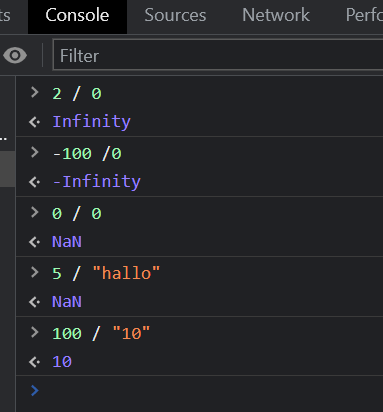

# Tipe data angka

didalam javascript tidak ada integer yang ada adalah floating point atau bilangan pecahan maksudnya adalah...

ukuran angka yang bisa di tampung oleh javascript adalah 64 bit artinya kita bisa menyimpan angka sebesar 2**64 (dua pangkat enam puluh empat) atau sama saja dengan 18 x 10**\*\*18 (18 x 1 miliar miliar) persisnya sebnayak ini .png>)

namun angka tersebut tidak bisa dipakai semua karena di dalam 64 bit tadi ada beberapa penanda yang harus digunakan untuk menampung angka-angka tertentu, kalo kalian masih bingung baca saja terus

ada beberapa jenis angka yang bisa kita simpan dengan javascript

### 1. Angka tanpa desimal

biasanya disebut dengan integer contohnya 10, 36, 4800, 34537

bukankah tadi diatas disebut bahwa didalam javascript tidak ada integer?&#x20;

jika kita melihat ada bilangan bulat pada javascript sebetulnya dibelakang layar yang di proses adalah bilangan pecahan namun tingkat akurasinya hanya sampai 15 digit, maksudnya gimana? coba lihat contoh berikut

<figure><figcaption></figcaption></figure>

ketika saya mengetikan angka 10 di console kemudian javascript mengembalikan angka 10

ketika saya mengetik angka 36 javascript mengembalikan angka 36

<figure><figcaption></figcaption></figure>

ketika saya mengetik angka 9 sampai 15 kali juga akan mengembalikan angka yang sama namun ketika saya mengetiknya dengan jumlah lebih dari 15 maka javascript mengembalikan angka yang berbeda, disini terjadi proses pembulatan artinya meskipun yang kita tuliskan adalah bilangan bulat yang di proses adalah bilangan pecahan, pada angka 9 yang berjumalh 16 kali sudah cukup untuk membulatkan menjadi angka yang berbeda&#x20;

namun kalian ga perlu pusing dengan ini apalagi kalo kamu membuat aplikasi yang tidak membutuhkan angka dengan tingkat akurasi yang tinggi

di seri ini kita juga hanya membahas perilaku dari angka tersebut dan tidak akan melakukan kalkulasi sampai sedetail itu

### 2. Angka dengan desimal

ini sama saja dengan bilngan pecahan contoh 3.14 (tiga koma empat belas), 0.5 ( nol koma lima), didalam javascript koma menggunakan titik

<figure><figcaption></figcaption></figure>

kita dapat menuliskan angka di belakang koma dengan maksimal 15 angka, jika kamu menulis lebih dari 15 angka di belakang koma maka angka sisa angka tersebut tidak di anggap atau hanya akan mendapatkan hasil 15 angka di belakang koma

### 3. Eksponen

kamu juga bisa menympan angka dengan bilangan yang paling besar atau bilangan yang paling kecil dengan eksponen contoh jika kita menuliskan bilangan 123e5 maka akan menghasilkan 12300000 atau juga sebelikanya jika kita menuliskan 123e-5 maka hasilnya 0.00123

<figure><figcaption></figcaption></figure>

### 4. Bilangan negatif

selanjutnya kamu bisa menuliskan bilangan negatif contoh -25, -0.24

jadi sebetulanya 64 bit tadi itu tidak bisa di pake untuk menuliskan biangan positif aja namun banyak hal bisa dilakukan

dan urutan bit penggunaanya bisa dilihat di gambar ini

<figure><figcaption></figcaption></figure>

1 bit digunakan untuk penanda jika bilangannya negatif

11 bit digunakan untuk eksponen

dan sisanya 52 bit digunakan untuk angka yang sebenarnya termasuk untuk menyimpan titik pecahan&#x20;

didalam javascript kamu tidak mengawali angka dengan 0 karna terkadang hasilnya tidak sesuai dengan harapan kita contoh kita mengetik angka 022 di console maka hasilnya 18 kenapa bisa seperti itu?

karna sebetulnya yang kita ketik adalah bilangan oktal bukan desimal, bilangan oktal adalah b ilangan basis 8 jadi dimulai dari 0-7 sedangan desimal bilangan basis 10 dari 0-9

sama juga kalo kita mengawali nya denga 0x maka akan dianggap bilangan hexadesimal yaitu bilangan basis 16 di muali dari 0 sampai f (0123456789abcdef)

<figure><figcaption></figcaption></figure>

Di dalam javascript juga terdapat angka spesial

* Infinity
* \-Infinity
* NaN

<figure><figcaption></figcaption></figure>

hati-hati dalam membagi angka dengan string yang didalmnya terdapat angka
